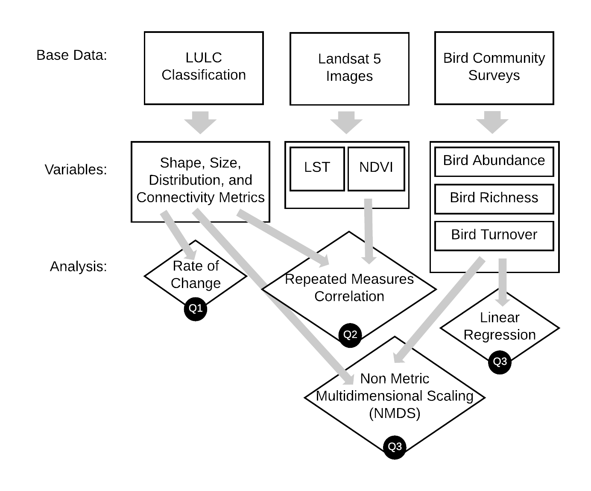

# Environmental Outcomes of Urban Land System Change: Comparing Riparian Design Approaches in the Phoenix Metropolitan Area

### Citation:
Stuhlmacher, M., Andrade, R., Turner, B.L. II, Frazier, A. and Li, W. (in press). “Environmental outcomes of urban land systems change: Comparing riparian design approaches in the Phoenix metropolitan area”. Land Use Policy.

### Summary:
Code for an integrated assessment of land system impacts on surface urban heat island, Normalized Difference Vegetation Index (NDVI), and bird biota at two riparian sites in the Phoenix, Arizona, metropolitan area with different design intentions.

### Methodology Diagram:
 

# Software Requirements

R version 3.5.1 

Google Earth Engine (JavaScript API)

# Base Data

All base data used in this article is publicly available.
The land use/land cover (LULC) classification and bird community surveys are available through the NSF funded Central Arizona-Phoenix Long-Term Ecological Research Program (CAP LTER), under grant number DEB-1832016.

LULC classification (Zhang and Li 2017), download [here.](https://sustainability.asu.edu/caplter/data/view/knb-lter-cap.650.1/)

Bird community survey (Bateman et al., 2017),  download [here.](https://sustainability.asu.edu/caplter/data/view/knb-lter-cap.46.16/)

The Landsat 5 images are made publicly available by the US federal government (USGS and NASA) and were accessed using Google Earth Engine.

# Analysis

### Research Question 1:
The LULC data was recoded into 5 classes— water, built-up, crop, vegetation, and desert/bare soil—and a 30-meter border was created according to McGarigal and Marks (1995).  

This data was input into FRAGSTATS (McGarigal et al., 2012) and Percentage of Landscape (PLAND), median Shape Index (SHAPE_MD), Interspersion and Juxtaposition Index (IJI), and median Euclidean Nearest Neighbor (ENN_MD) were calculated. The rate of change was calculated for the metrics in R.

### Research Question 2:
Google Earth Engine was used to compute Normalized Difference Vegetation Index (NDVI) and land surface temperature (LST) and normalize values to the study area. These values were input into a repeated measures correlation in R along with the landscape metrics calculated for research question 1.

### Research Question 3:
Bird abundance, richness, and turnover were computed from the raw bird community data. A linear regression was used to assess if there were differences in the trends at the two sites. Both the bird data and the landscape metrics were input into a nonmetric multidimensional scaling (NMDS) in R.

# References

Bateman, H.L., Childers, D.L., Katti, M., Shochat, E., Warren, P.S., 2017. Point-count bird censusing: long-term monitoring of bird abundance and diversity in central Arizona-Phoenix, ongoing since 2000. Environ. Data Initiat. https://doi.org/10.6073/pasta/201add557165740926aab6e056db6988

McGarigal, K., Cushman, S.A., Ene, E., 2012. FRAGSTATS v4: Spatial Pattern Analysis Program for Categorical and Continuous Maps. Comput. Softw. Program Prod. Authors Univ. Mass. Amherst. URL http://www.umass.edu/landeco/research/fragstats/fragstats.html

McGarigal, K., Marks, B.J., 1995. FRAGSTATS: spatial pattern analysis program for quantifying landscape structure.

Zhang, Y., Li, X., 2017. Land cover classification of the CAP LTER study area at five-year intervals from 1985 to 2010 using Landsat imagery. Environ. Data Initiat. https://doi.org/10.6073/pasta/dab4db27974f6c8d5b91a91d30c7781d

